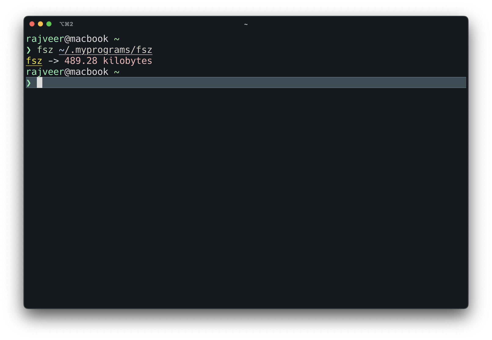

# fsz-rs

This is a simple command-line program for getting file size written in Rust using the [Helix Editor](https://github.com/helix-editor/helix).

## How to Use

To use the application, follow these steps:

1. Clone the repository.
2. Navigate to the project directory.
3. Run `cargo build --release`

### Command

`$ cargo run <file_path>`
